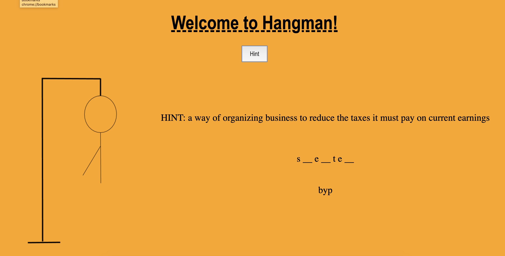

# Hangman using the Words API 🦖

## Description
The game of hangman is typically played with two players. This version of the game will be one person playing against the computer. The computer will generate a random word for the user to guess, presenting the user with only the number of letters in the word. The user will have seven chances to make the correct guess. The game will keep track of letters used. Optimized for desktop and mobile. 

## Hangman Wireframes
### Desktop 

### Mobile

## Features
1. Play button that will use an api call to retrieve a random word.
https://www.wordsapi.com/docs/?javascript#introduction
2. A hint button that will use the same api call to retrieve a definition for the word. 
3. Tracking the use of each letter by keystrokes. 
4. The drawing of the hanged man representing the incorrect guesses. 

## Technologies
HTML, CSS, JavaScript, and AJAX

## Problem Solving approach
I used several different approaches to solving the problems I ran into. I worked with our genius instructors (Brian really helped me a lot) as well as my peers. I also found that simply taking a break really helped me look at things differently once I returned to my code. Google is my best friend. 

## Struggles you encountered and how you solved them
Presenting an alert box with win or lose message. Of course I was able to add an alert box, more specifically the issue was that the alert box was appearing before the user was able to see the last letter. I got around this by printing the win or lose message to the page. 

## Problems you weren’t able to solve
Hangman is optimized for mobile phone, however, this app requires the use of the keyboar and the app on mobile does not present the keyboard. I was not able to resolve this. 

## Code that you are proud of

* The loop I did on the api call 
* The guesses that count towards the images of the hangman

